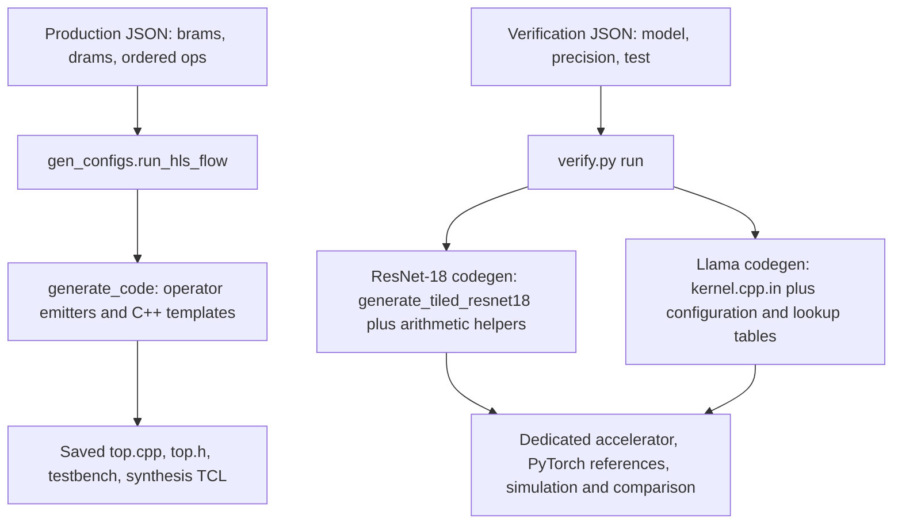

# Production generation versus dedicated verification generation

The two paths emit different accelerator implementations. The dedicated
verification generators do not consume the production `brams/drams/ops` JSON
or invoke `gen_configs.run_hls_flow` / `generate_code.generate_top_function`.

The three supplied production commands were reproduced in a temporary
directory. All **12 files** (`top.cpp`, `top.h`, `tb_top.cpp`, `run_hls.tcl`
for each project) matched the saved projects byte-for-byte. Original HLS was
unchanged. [Machine-readable evidence](regeneration_comparison.json) records
the inspected commit, configuration and generator hashes, and comparisons.
This audit did not run simulation or synthesis. Prior numerical execution
results concern ResNet-18, not the newly inspected ResNet-50.

| Aspect | Production commands | Dedicated `verify.py run` |
| --- | --- | --- |
| Configuration | Explicit buffer declarations, dimensions, ordered operator calls, arguments and loop controls | Architecture dimensions/profile, precision, tiles, synthetic parameters and verification policy |
| Graph definition | Already expanded in JSON, normally built by `auto_generate_json.py` | ResNet-18 graph constructed in Python; Llama graph fixed in the C++ template |
| Operator implementation | `generate_code.py` dispatches operators to Python emitters or individual C++ templates | Separate ResNet kernels and a separate complete Llama kernel |
| Memory movement | Must be explicitly represented in JSON operations | Written into the dedicated kernels and their layouts |
| Interfaces | Every DRAM argument and BRAM uses the single JSON `data_type` | Dedicated typed interfaces; Llama controls are integers and parameters are packed into one weight store |
| Arithmetic | Here `data_t=ap_fixed<16,5>` and hard-coded `acc_t=ap_fixed<32,10>`, implicit AP_TRN/AP_WRAP | ResNet uses AP_RND/AP_SAT, wider accumulation and shared-exponent handling; Llama uses integer codes, 64/128-bit accumulators and explicit rounding/saturation |
| Testbench | Loads text inputs, invokes top, writes outputs; no golden comparison | Creates deterministic binary inputs, runs fixed and FP64 PyTorch references and compares actual simulation outputs |
| Execution | Python only writes files. All three JSONs select `task=["csynth"]` in emitted TCL | CLI actually invokes reference generation, simulation and comparison |

Production entry points: [gen_configs.py](../../../gen_configs.py),
[generate_code.py](../../../generate_code.py).
Dedicated entry points: [ResNet codegen](../../models/resnet18/codegen.py),
[Llama codegen](../../models/llama3/codegen.py),
[Llama kernel](../../models/llama3/kernel.cpp.in).

## ResNet differences and static findings

The supplied `RESNET50_config_ap_fixed_16_5_.json` describes the full-buffer
ResNet-50 bottleneck graph (3/4/6/3 blocks), with 140 BRAM declarations,
105 DRAM arguments and 172 operation records. Dedicated verification supports
ResNet-18 basic blocks (2/2/2/2); it does not validate ResNet-50.

Of the production ResNet-50's 105 DRAM arguments, 103 are weight/BN parameters.
None occurs in an operator argument. The only `load` is
`DRAM_input -> BRAM_feat_input`. The graph declares matching internal parameter
buffers but never loads them. The testbench initializes external DRAM arrays;
that does not initialize separate internal BRAM arrays. The omission originates
in `auto_generate_json.generate_resnet_architecture` and its block builders.
`generate_top_function` emits the supplied calls without inferring missing loads.

The production `conv_template.cpp` accumulates directly into `data_t` outputs,
so each product addition commits to the narrow format. The BN template also
uses `data_t`, making its `1e-5` epsilon zero at Q16.5. The average-pool template
uses a `data_t` sum and casts its element count to `data_t`; count 49 becomes
-15. Dedicated ResNet uses accumulator buffers, explicit parameter tile loads,
an `acc_t` pooling divisor, and a different BN arithmetic path. Configurable
ResNet codegen additionally replaces the vendor BN square-root call with
`verification_sqrt`, so its changes extend beyond tracing/testbench insertion.

## Llama differences and static findings

Both production projects describe full Llama 3 8B dimensions (32 layers,
4096 hidden, 14336 FFN, 32 query heads, 8 KV heads, 128 head dimension,
128256 vocabulary, context capacity 2048). Each JSON has 20 BRAM declarations,
30 DRAM arguments and 5440 operation records, including loop begin/end records.
Layer sequences are expanded by the JSON builder. The dedicated template
instead has a layer loop controlled by generated constants and packed offsets.

The production prefill and decode tops are separate projects named `top`.
The dedicated source has `llama_prefill` and `llama_decode` wrappers over the
same core, with a shared explicitly managed cache and scratch layout.

Confirmed source differences:

- All production ports use `data_t`, including token IDs, length and position.
  The dedicated interfaces use `int32_t` tokens and `int` control values.
- Production linear/RMS reductions write partial sums back into `data_t`
  after each input tile. The dedicated linear kernel retains wide sums across
  all input tiles and converts only after the complete reduction.
- Production RMSNorm divides by `(acc_t)4096`, which wraps to zero.
  Dedicated RMSNorm divides a wide integer sum by integer `HIDDEN`.
- Production attention computes `1 / sqrt((data_t)128)`; the cast is zero.
  Dedicated attention uses a precomputed integer scale constant.
- Production RoPE computes float `powf` and vendor sine/cosine at runtime;
  dedicated RoPE reads precomputed coefficients. Production nonlinearities
  use vendor `hls::exp`; dedicated exp/SiLU use generated lookup tables.
- Production `o_proj` uses `DRAM_attn` for both input and output in both JSON
  builders (`auto_generate_json.py`, prefill line 2743, decode line 2837).
  Its output-tile loop stores the first output chunk before the next chunk
  reloads the input. Thus later chunks can consume already overwritten input.
  Dedicated `run_core` calls `linear(context, ..., norm, ...)` with separate
  input/output buffers. This is a static dataflow finding, not an observed
  full-8B numerical mismatch from this audit.
- Production causal masking sets future scores to finite -8 but still feeds
  them through softmax/context accumulation; the dedicated kernel iterates only
  over visible keys. Finite masking can admit nonzero future contributions.

## Where corrections belong

| Problem | Production source to change |
| --- | --- |
| Missing parameter loads; unsafe in-place projection | Graph builders in `auto_generate_json.py`, then regenerate the affected JSONs |
| Token/control types and typed accumulator buffers | JSON schema/type handling plus `generate_code.py` declarations/interfaces |
| Zero-divisor casts, reduction widths, quantization and masking | Operator emitters in `generate_code.py` and the applicable C++ templates |
| Functional acceptance evidence | Directly simulate the regenerated production tops with independently expressed FP64 and version-specific fixed references |

Changing only `verify.py` cannot repair those production outputs. Copying a
dedicated top into the production directory would not establish that the
production JSON-to-HLS generator produced it. Numerical changes require fresh
verification and fresh hardware measurements for claims about the new design.

The old nominal `verify.py` results also use a different acceptance policy:
FP64 is `DIAGNOSTIC_ONLY` unless tolerances are configured, and `finish()` accepts
implementation PASS when the mathematical verdict is not FAIL. Direct existing
verification requires both exact fixed agreement and the selected FP64 limits.
Synthetic inputs/parameter generation differ between workflows, so their
historical error magnitudes are not a controlled same-input A/B comparison.
